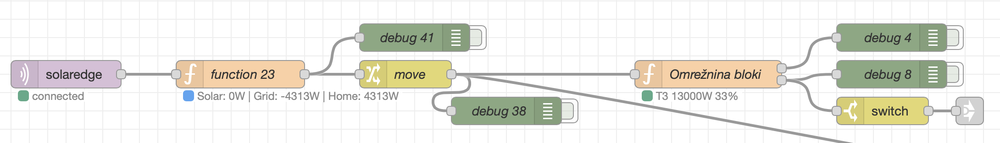

# SolarEdge MQTT Monitor

A Python script to monitor SolarEdge inverters via Modbus TCP and publish the data to an MQTT broker. This tool allows for real-time monitoring of your SolarEdge inverter's performance metrics.

Also added is a Node Red function node code to process the incoming MQTT data and use it for other purposes.



## Features

- Modbus TCP connection to SolarEdge inverters
- Real-time monitoring of inverter metrics
- MQTT integration for data publishing
- Comprehensive logging with rotation
- Support for both single and three-phase inverters
- Battery and meter data collection (if available)
- Connection monitoring and automatic reconnection
- JSON output option

## Prerequisites

- Python 3.x
- SolarEdge inverter with Modbus TCP enabled
- Network access to the inverter
- MQTT broker (optional, for data publishing)

## Installation

1. Clone this repository:
```bash
git clone https://github.com/yourusername/solaredge-mqtt-monitor.git
cd solaredge-mqtt-monitor
```

2. Install the required Python packages:
```bash
pip3 install -r requirements.txt
```

## Required Python Packages

- solaredge_modbus
- paho-mqtt

## Usage

Basic usage:
```bash
python3 solar_edge_mqtt.py [OPTIONS] host port
```

Example with MQTT publishing:
```bash
python3 solar_edge_mqtt.py --json --mqtt-server 192.168.1.100 --mqtt-port 1883 --mqtt-topic solaredge --interval 10 192.168.1.50 1502
```

### Command Line Arguments

- `host`: Modbus TCP address of the inverter
- `port`: Modbus TCP port number
- `--timeout`: Connection timeout in seconds (default: 1)
- `--unit`: Modbus device address (default: 1)
- `--json`: Output data in JSON format
- `--mqtt-server`: MQTT broker address
- `--mqtt-port`: MQTT broker port (default: 1883)
- `--mqtt-topic`: MQTT topic to publish data to
- `--interval`: Data refresh interval in seconds (default: 60)

## Monitored Data

The script collects the following data from the inverter:

### Basic Information
- Manufacturer
- Model
- Type
- Version
- Serial Number
- Status

### Electrical Parameters
- Current (AC and DC)
- Voltage (AC and DC)
- Power (AC, DC, Apparent, Reactive)
- Power Factor
- Frequency
- Total Energy Production

### Additional Data (if available)
- Battery status and metrics
- Meter readings
- Temperature
- Phase-specific measurements (for three-phase inverters)

### Monitoring Metadata
- Last successful read timestamp
- Connection attempts
- Consecutive failures

## Logging

The script maintains detailed logs with the following features:
- Rotating log files (max 5MB per file)
- Console output
- Debug and info level logging
- Error tracing
- Connection status monitoring

Log files are stored at `/mnt/debug.txt` by default.

## Error Handling

The script includes robust error handling for:
- Connection failures
- Read errors
- MQTT publishing issues
- Network timeouts
- Invalid data


This software is not affiliated with SolarEdge Technologies Inc. Use at your own risk.
